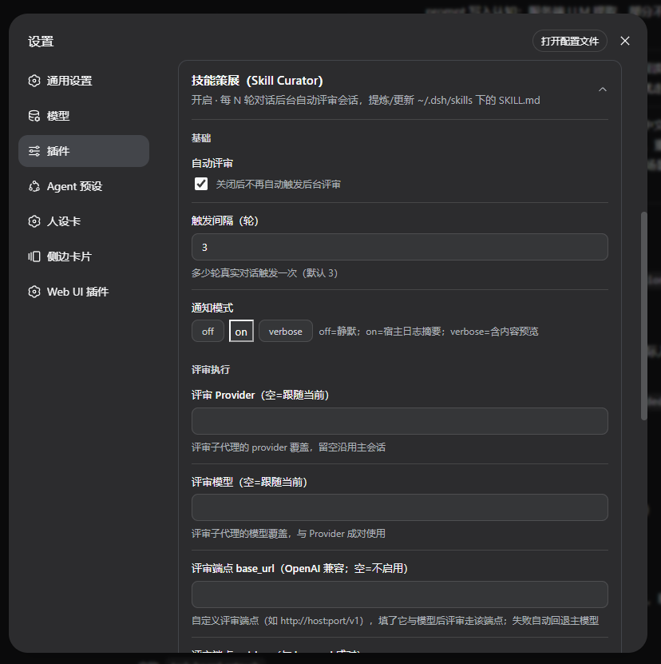

# dsh-skill-curator

Automatic skill curation for [DeepSeek Harness](https://github.com/deepseek-ai/deepseek-harness) (DSH). After every N real conversation turns (default **3**), the plugin fires a background **subagent** that reads a digest of the session and **creates or updates `SKILL.md` files** under the user skills directory (`~/.dsh/skills/<name>/SKILL.md`) — the same self-improvement loop Nous Research's Hermes Agent runs, ported to DSH as a zero-intrusion bundle plugin.

> 中文说明见 [README.zh-CN.md](README.zh-CN.md).

## How it works

```
turn ends ──▶ agent/turn-stopping (scoped listener, counted per agent)
    │ 3 turns reached?  (skillNudgeInterval)
    ▼
async fire-and-forget (never blocks the turn close)
    ▼
session digest built ──▶ latest N messages verbatim + older turns compressed
    ▼
spawn subagent (provider: spawn) with digest + review instructions
    │  toolFilter allow = skill-library-* only (whitelist, hermes-style)
    ▼
subagent reviews and writes ~/.dsh/skills/<name>/SKILL.md
    │  frontmatter is stamped author: dsh-skill-curator (ownership marker)
    ▼
summary logged (host journal) + visible in the settings card status panel
```


*The review subagent runs as a visible task in the Tasks panel — here you see queued/idle `skill review` entries; open the panel to watch a curation as it happens.*

Manual trigger: `/skill-refine [focus]` runs a review of the current session immediately.

## Design decisions (vs Hermes)

| Hermes | dsh-skill-curator |
|---|---|
| turn_finalizer nudge counters (10) | scoped `agent/turn-stopping` counters (3, configurable) |
| fork of AIAgent in a daemon thread | platform subagent (`ctx.subagents.start`) — visible in the UI, fully isolated session |
| replay full conversation (warm prefix cache) | digest injection (tail-verbatim + head compression) — DSH has no cache advantage |
| runtime tool whitelist (memory+skills) | `toolFilter.allow` whitelist + prompt constraint |
| curator ownership markers | frontmatter `author: dsh-skill-curator` + `skill-library-adopt` |
| `/refine` | `/skill-refine` command |

Behavioral parity matrix: [docs/COMPARISON.md](docs/COMPARISON.md).

## Install

```bash
cd /path/to/dsh-skill-curator
dsh plugin --profile web add ./
# restart dsh, then open: Settings → Plugins tab → "Skill Curator" card
```

Skip the restart? The plugin only takes effect on next start (standard bundle plugin; no dsh source changes, ever).

## Settings (Settings → Plugins tab → "Skill Curator" card)

| Settings card (part 1) | Settings card (part 2) |
|:---:|:---:|
|  |  |

- **enabled** — master switch (default on)
- **skillNudgeInterval** — turns between reviews (default 3)
- **notifyMode** — off / on / verbose (segmented buttons)
- **reviewProvider / reviewModel** — optional review subagent model override (empty = follow the session's current model)
- **reviewBaseUrl / reviewApiKey** — optional custom review endpoint (OpenAI-compatible `/chat/completions`). When `reviewBaseUrl` + `reviewModel` are set, the review subagent runs against that endpoint through a dedicated adapter route (provider name = `reviewProvider`, or `skill-curator-review` by default). Settings are read live on every request — no restart needed
- **Review history** persists to `~/.dsh/skill-curator/reviews.json` (last 50 entries) — survives plugin removal/reinstall and restarts
- **Review resilience** — two layers for endpoint/model failures (HTTP/network/auth/rate-limit/model missing/timeout): ① if the custom endpoint fails, the review retries **once** on the session's own model (marked `⚠️已回退主模型` in host log / review log / status panel); ② if the final attempt then dies on an endpoint-class error or a detail-less `killed`, it retries up to `reviewRetryCount` times with `reviewRetryDelayMs` backoff — a model connection blip no longer loses the review. Tool-layer errors are never retried
- **reviewTimeoutMs** — review subagent budget (default 15 min)
- **reviewRetryCount** — extra retries when the final review attempt dies on endpoint/model-layer failures (connection reset, HTTP errors, timeouts) or a detail-less `killed`; `0` disables retrying. Tool-layer errors are never retried. Default 1
- **reviewRetryDelayMs** — backoff base for retries, n-th retry waits `base × n` ms (default 5000)
- **digestTail / digestMaxChars** — digest shape
- **adoptSkills** — comma-separated names of skills the curator may maintain although created elsewhere

## Skill library tools (whitelist)

The review subagent can only call these six (they are also usable by any session):

| Tool | Purpose |
|---|---|
| `skill-library-list` | list skills (name, description, owned?) |
| `skill-library-read` | read one SKILL.md |
| `skill-library-create` | create a class-level umbrella skill (Chinese body, bilingual description) |
| `skill-library-patch` | targeted `oldString→newString` or whole-body replacement (frontmatter preserved) |
| `skill-library-write-file` | support files under `references/` `templates/` `scripts/` |
| `skill-library-adopt` | take ownership of an unowned skill (stamps the author marker) |

Ownership guard: only skills stamped `author: dsh-skill-curator` or listed in `adoptSkills` can be patched; everything else is refused with an explicit "adopt first" message. Paths are boundary-checked; writes are atomic (tmp + rename).

## Development

```bash
pnpm install        # or symlink node_modules to your dsh install (see test notes)
pnpm test           # node --test unit suites
node test/smoke.mjs         # module/tool/whitelist smoke
node test/client-smoke.mjs  # client bundle smoke (real component-tree execution)
```

## License

MIT